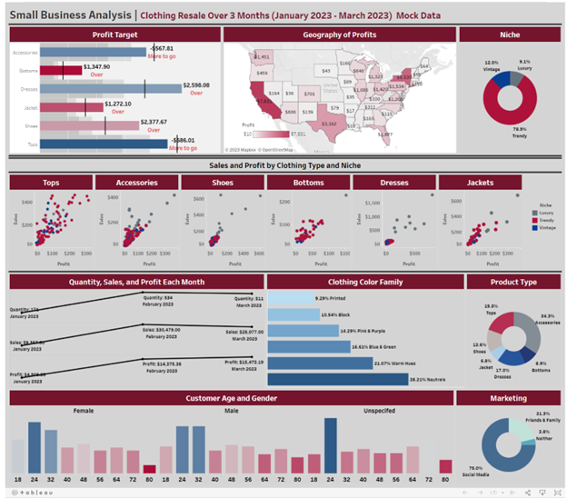

## Clothing-Business-Analysis-Tableau
This repository links to a fun red color themed Tableau dashboard for a new online business that sells pre-loved clothing. This is a fictional business with mock data created by me. The purpose of the dashboard is to identify key sellers and profits and how to improve marketing for continued success. Geomapping, scatter plots, donut charts, overal graphs for profit target goals, and more are included in this striking and comprehensive dashboard.

## Link to dashboard
[Clothing Business Dashboard by Kristi Bischoff](https://public.tableau.com/app/profile/kristi.bischoff/viz/SmallBusinessAnalysis_16826693039690/Dashboard1)

## Screenshot of dashboard

